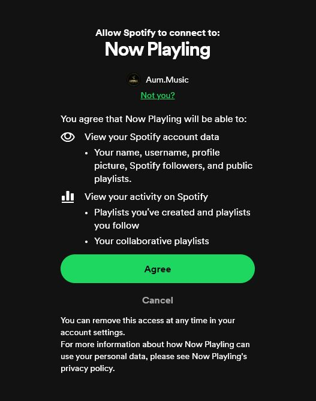
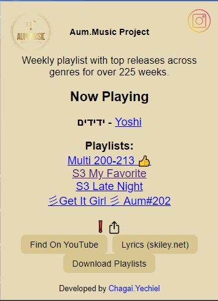
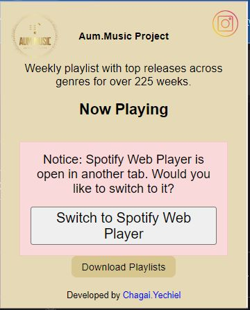
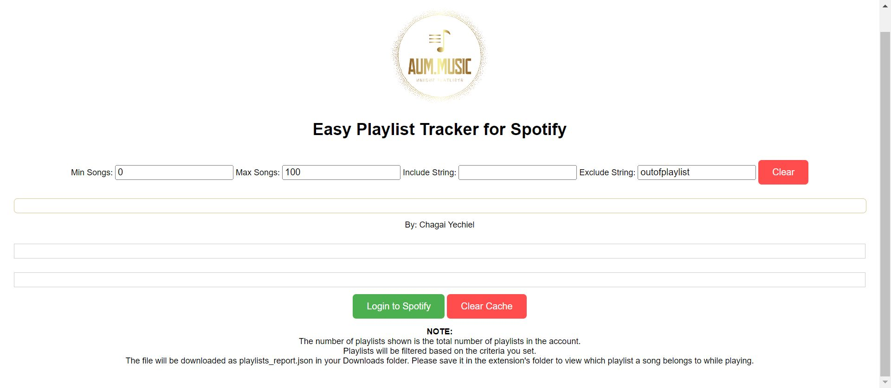

# 🎵 Aum Extension - Spotify Workflow Optimizer

**A custom Chrome Extension built to solve a specific pain point in managing large-scale music libraries (750+ playlists).**

## 📖 The Story
Managing a massive music library is operationally expensive. As a curator with over **900 playlists**, organizing tracks became a nightmare. I had no quick way to know if a song playing on the Web Player was already assigned to a specific playlist without manually searching or going through a "trial and error" process of adding duplicates.

Identifying this friction, I built this extension to act as a "second brain" for the Spotify Web Player, giving me instant visibility and quick actions.

## 📸 Visual Demo

<table>
  <tr>
    <td align="center">
      
       
      Main Interface
    </td>
    <td align="center">
      
       
      Real-time Playlist Check
    </td>
  </tr>
  <tr>
    <td align="center">
      
       
      Quick Switching
    </td>
    <td align="center">
      
       
      Data Export
    </td>
  </tr>
</table>

## 🚀 Key Features

### 🧠 Smart Playlist Tracking
* **Real-Time Detection:** Automatically identifies the "Now Playing" song directly from the DOM.
* **Instant Cross-Reference:** Scans cached playlist data to list exactly which of your playlists already contain the current track.
* **Advanced Filtering:** Filter your playlists by string (include/exclude) or song count (min/max) to find the right list instantly.

### 🛠️ Productivity Tools
* **Find on YouTube:** One-click search to find the video version of the playing track.
* **Lyrics Integration:** Opens Skiley.net for instant access to lyrics.
* **Data Export:** Capability to download playlist metadata as JSON/CSV for offline analysis.
* **Quick Share:** Instantly copy the track's Spotify URL to the clipboard.

## 🛠️ Tech Stack
* **Core:** Native JavaScript (ES6+), HTML, CSS.
* **Platform:** Chrome Extension API (Manifest V3 compatible).
* **Integration:** Spotify Web API (OAuth 2.0 Implicit Grant).
* **Performance:** Implements local caching (LocalStorage) to handle large datasets (thousands of tracks) without hitting API rate limits during standard usage.

## ⚙️ Installation (Local)
1.  Clone this repository.
2.  Open Chrome and navigate to `chrome://extensions/`.
3.  Enable **Developer mode** (top right).
4.  Click **Load unpacked** and select the extension directory.
5.  Click the extension icon to authenticate with Spotify.

## ⚠️ Disclaimer
*This project was built as a rapid "Proof of Concept" productivity tool for personal use. It prioritizes immediate functionality and specific workflow solutions over enterprise-grade architecture.*

---
*Created by Chagai Yechiel*
